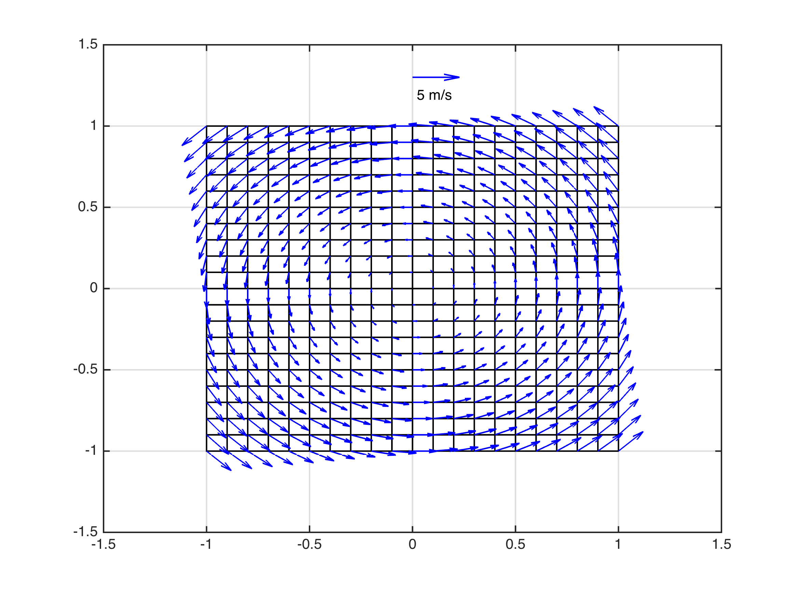
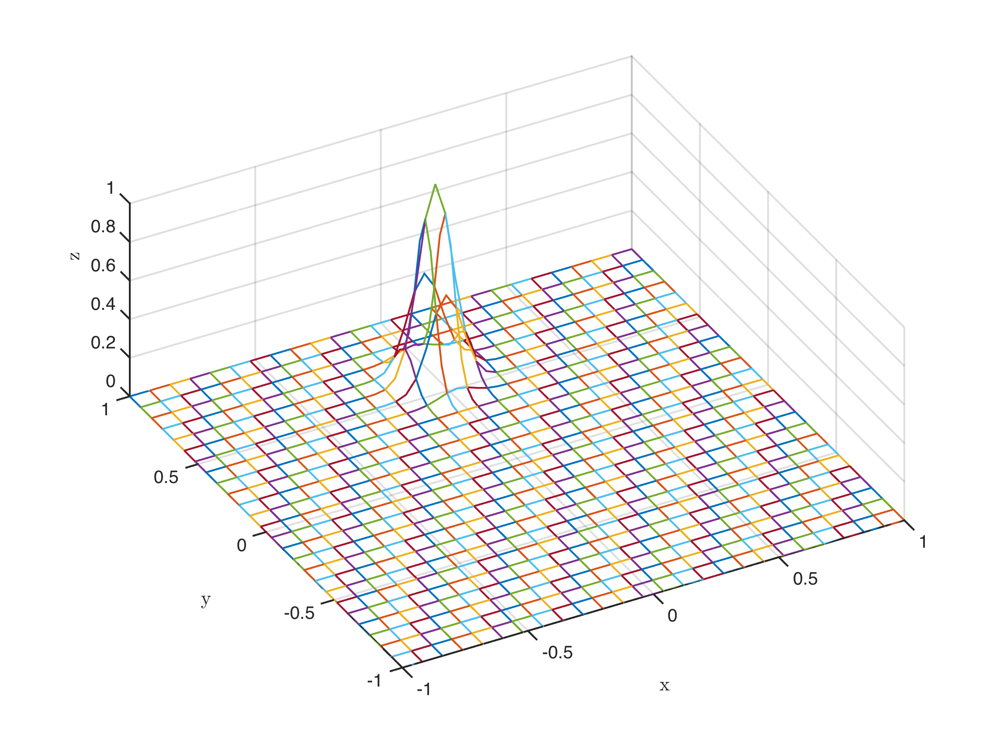
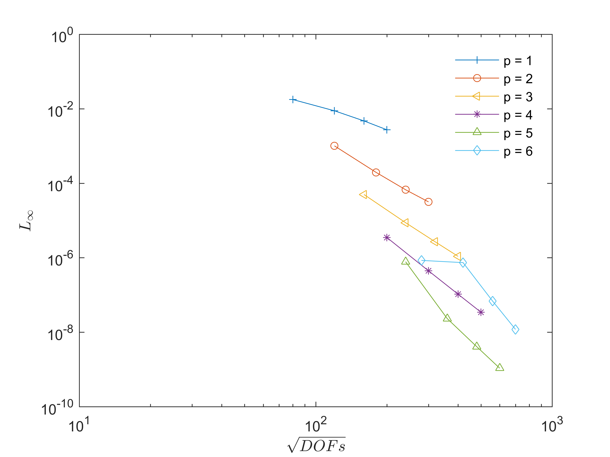
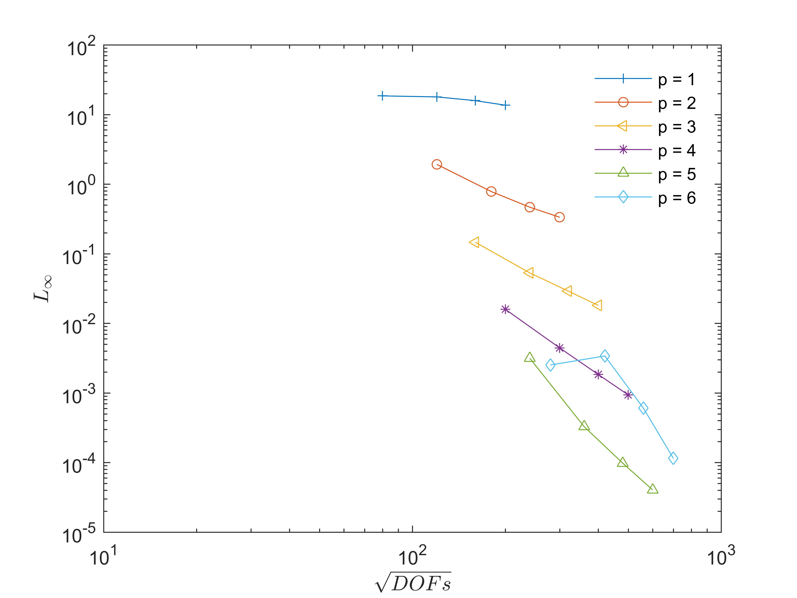

#Introduction

Two dimensional linear transport problem in order to assess the performance of the nodal DG method on triangular elements and on quadrilateral elements.

#Problem description

The governing equation

$$\frac{\partial u}{\partial t} + \nabla \cdot \mathbf{f}(u, x, t) = 0, \quad x\in\Omega$$

where *u* is the scalar variable, the flux term is

$$\mathbf{f} = \mathbf{a}(x) = (a_1(x)u, a_2(x)u).$$

1. computation domain
$[-L, L]$, where $L = 1$.

2. advection velocity
$[a_1, a_2] = (-wy, wx)$, where $w = 5\pi/6$. The advection period is $T = \frac{2\pi}{w} = 2.4$ s.

3. initial condition
$u(\mathbf{x}, t = 0) = exp\left( -\sigma \left| \mathbf{x} - \mathbf{x}_c \right|^2 \right)$, where $\mathbf{x}_c = (0, 3/5)$, $\sigma = 125 \times 1000/33^2$.

4. computation meshes
different resolutions: [20 x 20], [40 x 40], [60 x 60].
different mesh types:
	1. triangle mesh
	2. square mesh
	3. skewed-rectangular mesh

5. boundary condition
transmissive  boundary condition (zero gradient).

#Result

##1. trangle mesh

For high order (p>2), the algorithm needs slope limiter to preserve stability.

##2. square mesh

p = 1

|nele 	| DOFs 	| L2		| Rate | Linf 	| Rate |
|---| --- | --- | --- |---| --- | --- |
|40 	| 160	|1.77e-02 	|0.00 	|1.85e+01 	|0.00 	|
|60 	| 240	|8.83e-03 	|1.72 	|1.79e+01 	|0.08 	|
|80 	| 320	|4.72e-03 	|2.18 	|1.58e+01 	|0.43 	|
|100 	| 400	|2.73e-03 	|2.46 	|1.36e+01 	|0.67 	|
|Fitted | \		|\			|2.03 	|\ 			|0.33 	|

p = 2

|nele 	| DOFs 	| L2		| Rate | Linf 	| Rate |
|---| --- | --- | --- |---| --- | --- |
|40 	| 360	|1.01e-03 	|0.00 	|1.92e+00 	|0.00 	|
|60 	| 540	|1.96e-04 	|4.06 	|7.82e-01 	|2.22 	|
|80 	| 720	|6.69e-05 	|3.73 	|4.66e-01 	|1.80 	|
|100 	| 900	|3.16e-05 	|3.36 	|3.34e-01 	|1.49 	|
|Fitted | \		|\			|3.80 	|\ 			|1.92 	|

p = 3

|nele 	| DOFs 	| L2		| Rate | Linf 	| Rate |
|---| --- | --- | --- |---| --- | --- |
|40 	| 640	|4.99e-05 	|0.00 	|1.46e-01 	|0.00 	|
|60 	| 960	|8.73e-06 	|4.30 	|5.30e-02 	|2.51 	|
|80 	| 1280	|2.68e-06 	|4.10 	|2.90e-02 	|2.09 	|
|100 	| 1600	|1.09e-06 	|4.05 	|1.81e-02 	|2.11 	|
|Fitted | \		|\			|4.18 	|\ 			|2.28 	|

p = 4

|nele 	| DOFs 	| L2		| Rate | Linf 	| Rate |
|---| --- | --- | --- |---| --- | --- |
|40 	| 1000	|3.49e-06 	|0.00 	|1.59e-02 	|0.00 	|
|60 	| 1500	|4.45e-07 	|5.08 	|4.43e-03 	|3.16 	|
|80 	| 2000	|1.05e-07 	|5.02 	|1.84e-03 	|3.05 	|
|100 	| 2500	|3.44e-08 	|4.99 	|9.37e-04 	|3.02 	|
|Fitted | \		|\			|5.04 	|\ 			|3.09 	|

p = 5

|nele 	| DOFs 	| L2		| Rate | Linf 	| Rate |
|---| --- | --- | --- |---| --- | --- |
|40 	| 1440	|7.80e-07 	|0.00 	|3.15e-03 	|0.00 	|
|60 	| 2160	|2.32e-08 	|8.67 	|3.28e-04 	|5.58 	|
|80 	| 2880	|4.08e-09 	|6.04 	|9.80e-05 	|4.20 	|
|100 	| 3600	|1.08e-09 	|5.97 	|4.04e-05 	|3.97 	|
|Fitted | \		|\			|7.17 	|\ 			|4.76 	|

p = 6

|nele 	| DOFs 	| L2		| Rate | Linf 	| Rate |
|---| --- | --- | --- |---| --- | --- |
|40 	| 1960	|8.48e-07 	|0.00 	|2.52e-03 	|0.00 	|
|60 	| 2940	|7.39e-07 	|0.34 	|3.40e-03 	|-0.74 	|
|80 	| 3920	|6.85e-08 	|8.26 	|6.05e-04 	|6.00 	|
|100 	| 4900	|1.19e-08 	|7.85 	|1.15e-04 	|7.45 	|
|Fitted | \		|\			|4.74  	|\ 			|3.35 	|

Figure 3. $\|u - u_h \|_2$ error of square meshes as a function of $\sqrt{DOFs}$ for different orders of p

Figure 4. $\|u - u_h \|_2$ error of square meshes as a function of $\sqrt{DOFs}$ for different orders of p

#Conclusion

1. For square meshes, the numerical scheme can preserve stability without slope limiter and achieve the optimial order of accuracy (for p < 6).
2. The error of square meshes decrease as DOFs increases. With the same number of DOFs, higher order scheme produce less numerical errors.

#Reference

[1] Wirasaet, D., Tanaka, S., Kubatko, E.J., Westerink, J.J., Dawson, C., 2010. A performance comparison of nodal discontinuous Galerkin methods on triangles and quadrilaterals. Int. J. Numer. Meth. Fluids 64, 1336–1362. doi:10.1002/fld.2376

