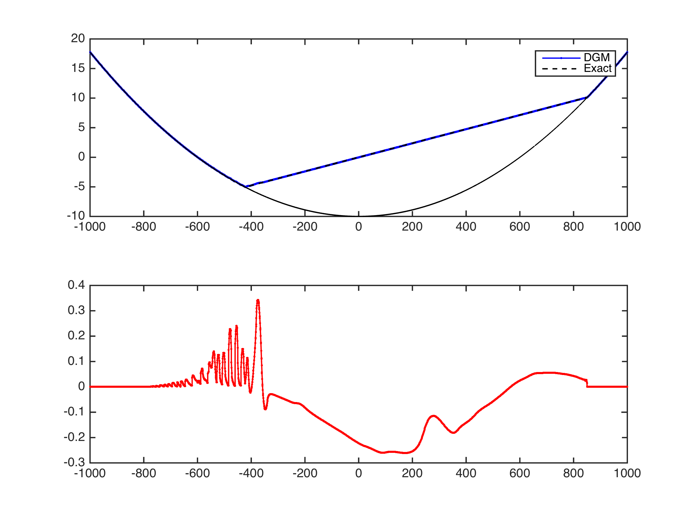
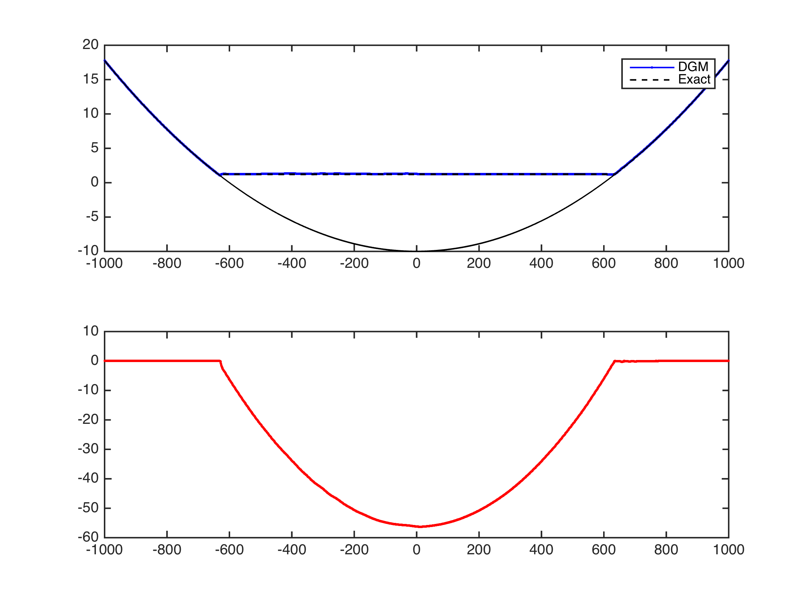
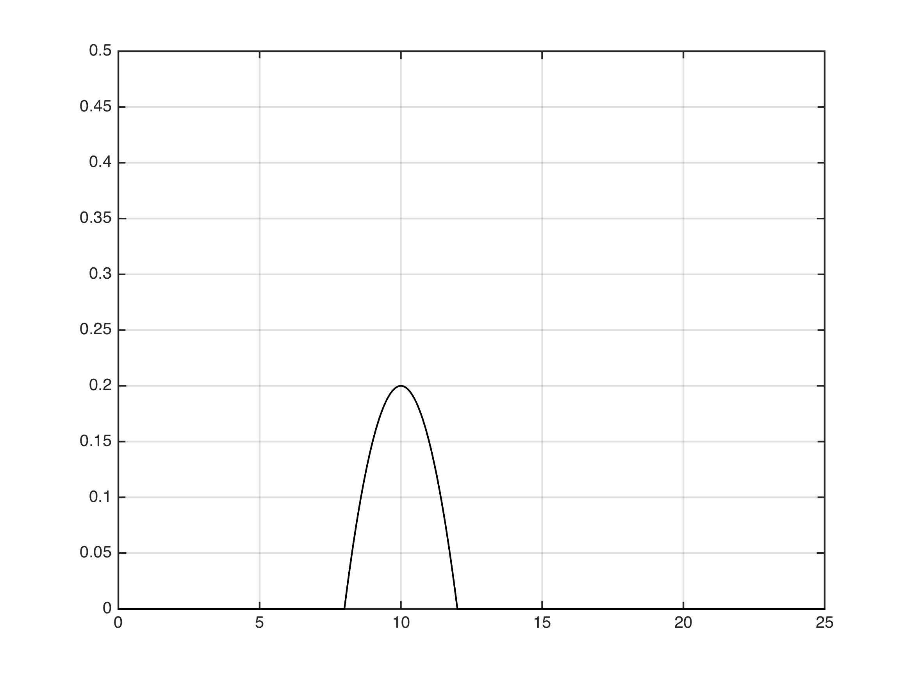

# 一维浅水方程

## 1. 控制方程

根据物理变量的不同，浅水方程可以分为两种，分别以水深 $h$ 和自由水位 $\eta$ 为自变量。
以水深 $h$ 为自由变量的控制方程为

$$
\frac{\partial U}{\partial t} + \frac{\partial F(U)}{\partial x} = S(U)
$$

$$
U = \begin{bmatrix}\eta \cr q_x \end{bmatrix} \quad F = \begin{bmatrix}q_x \cr \frac{q_x^2}{h} + \frac{1}{2}g(\eta^2 - 2\eta z) \end{bmatrix} \quad S = \begin{bmatrix}0 \cr -g\eta\frac{\partial z}{\partial x} \end{bmatrix}
$$

## 2. 数值离散

$$ U_h = \sum{l_j U_j} \quad F_h(U) = \sum{l_j F(U_j)} $$


$$
\int_{\Omega} l_i l_j \frac{\partial U_j}{\partial t} dx+
\int_{\Omega} l_i \frac{\partial l_j}{\partial x} F(U_j) dx= 0
$$


$$
\int_{\Omega} l_i l_j \frac{\partial U_j}{\partial t} dx +
\int_{\Omega} l_i \frac{\partial l_j}{\partial x} F(U_j) dx+
\oint_{\partial \Omega} l_i l_j (F^* - F)\cdot \vec{n} ds = 0  $$

$$
JM \frac{\partial U}{\partial t} + JMD_x F(U) + J_E M_E (F^* - F)\cdot \vec{n} = 0
$$

ODE:
$$
\frac{\partial U}{\partial t} = -\frac{\partial r}{\partial x}D_r F(U) + \frac{J_E}{J}M^{-1} M_E (F^* - F)\cdot \vec{n}=L(U(t))
$$

$$
rhs = -\frac{\partial r}{\partial x}D_r F(U) + \frac{J_E}{J}M^{-1} M_E (F - F^*)\cdot \vec{n}
$$

It is important to point out that at dry cells no flux is flow inside the elemnt. Therefor, for dry cells

$$
rhs = \frac{J_E}{J}M^{-1} M_E (F - F^*)\cdot \vec{n}
$$

## 3. 数值通量
### 3.1.HLL flux function

Formulations are given as

$$F^{HLL} = \left\{ \begin{matrix}
F^- \cr
\frac{S_R F^- - S_L F^+ + S_L S_R(U^+ - U^-)}{S_R S_L} \cr
F^+ \end{matrix} \right.
\begin{matrix}
S_L \geq 0 \cr
S_L < 0 < S_R \cr
S_R \leq 0
\end{matrix}$$

Wave Speed is suggested by Fraccarollo and Toro (1995)

$$ S_L = min(u^- - \sqrt{gh^-}, u^* - c^*)$$

$$ S_R = min(u^+ + \sqrt{gh^+}, u^* + c^*)$$

$u^*$ and $c^*$ is defined by

$$u^* = \frac{1}{2}(u^- + u^+) + \sqrt{gh^-} - \sqrt{gh^+}$$

$$c^* = \frac{1}{2}(\sqrt{gh^-} + \sqrt{gh^+}) + \frac{1}{4}(u^- - u^+)$$

for wet-dry interface, the wave speed is giving as

1. left-hand dry bed
$$
S_L = u^+ - 2\sqrt{g h^+} \quad S_R = u^+ + \sqrt{g h^+}
$$

2. right-hand dry bed
$$
S_L = u^- - \sqrt{g h^-} \quad S_R = u^- + 2\sqrt{g h^-}
$$

3. both sides are dry
$$
S_L = 0 \quad S_R = 0
$$

**Noticing. 1**
For flux terms, the discharge $q^2$ is divided by water depth $h$
$$F = \begin{bmatrix} q \cr gh^2/2 + q^2/h \end{bmatrix}$$

so a threadhold of water depth $h_{flux}$ ( $10^{-3}$m ) is add into flux function `SWEFlux.m`. When $h$ is less than $h_{flux}$, the $q^2/h$ is approximated to 0 as there is no flow at this node.

**Noticing. 2**
When defining the dry beds, another threadhold of water depth $h_{dry}$ is used. It is convenient to deine $h_{dry}$ equals to $h_{flux}$.

###3.2.Rotational invariance

$$T = \begin{bmatrix} 1 & 0 \cr
0 & n_x\end{bmatrix} \quad
T^{-1} = \begin{bmatrix} 1 & 0 \cr
0 & n_x\end{bmatrix}$$

$$\mathbf{F} \cdot \mathbf{n} = \mathbf{F} \cdot n_x = T^{-1}\mathbf{F}(TU)$$

defining $Q = TU$, the numerical flux $\hat{\mathbf{F}}$ can be obtained through the evaluation of numerical flux $\mathbf{F}$ by

$$\hat{\mathbf{F}} \cdot n = T^{-1}\mathbf{F}^{HLL}(Q)$$


## 4.Limiter

斜率限制器对浅水方程计算稳定性**至关重要(crucial)**。


For better numerical stability, minmod limiter is used in limiting the discharge and elevation.

Check `testing/Limiter1D/doc` for more details about minmod limiter.

## 5. Positive preserving limiter

For the thin layer approach, a small depth ( $h_{positive} = 10^{-3} m$) and zeros velocity are prescribed for dry nodes.

The first step is to define wet elements. After each time step, **the whole domain** is calculated; If the any depth of nodes in $\Omega_i$ is greater than $h_{positive}$, then the element is defined as wet element, otherwise the water height of all nodes are remain unchanged.

The second step is to modify wet cells; If the depth of any nodes is less than $h_{positive}$, then the flow rate is reset to zero and the new water depth is constructed as

$$
\begin{array}{c}
\mathrm{M}\Pi_h h_i(x) = \theta_1 \left( h_i(x) - \bar{h}_i \right) + \bar{h}_i \cr
\mathrm{M}\Pi_h q_i(x) = \theta_1 \left( q_i(x) - \bar{q}_i \right) + \bar{q}_i \cr
\end{array}
$$

where

$$
\theta_1 = min \left\{ \frac{\bar{h}_i - \xi }{\bar{h}_i - h_{min}}, 1 \right\}, \quad h_{min} = min\{ h_i (x_i) \}
$$

It is necessary to fulfill the restriction that the mean depth $\bar{h}_i$ is greater than $\xi$, i.e. $0$ m. In the function `PositiveOperator`, if the mean depth of element is less than $\xi$, all nodes will add a small depth $\xi - \bar{h}_i$ to re-fulfill the restriction. At last, all nodes with negative water depth $h_i(x_j) < 0$ will be modified to zero.

## 6. Wet/Dry treatment

### 6.1. Identification of dry cells

`WetDryJudge.m`

```
function isWet = WetDryJudge(mesh, h, physics)
```

### 6.2. Cancellation of gravity


## 7.Numerical Test

### 7.1.Wet dam break

| Model Setting | value |
| --- | --- |
| channel length | 1000m |
| dam position | 500m |
| upstream depth | 10m |
| downstream depth | 2m |
| element num | 400 |
| Final Time | 20s |


### 7.2.Dry dam break

| Model Setting | value |
| --- | --- |
| channel length | 1000m |
| dam position | 500m |
| upstream depth | 10m |
| downstream depth | 0m |
| element num | 400 |
| Final Time | 20s |

The analytical solution from Izem et al. (2016)

$$
\begin{aligned}
h_1(x,t) = \left\{ \begin{matrix}
h_0, & \text{if} \quad x\le -t \sqrt{gh_0}, \cr
\frac{1}{9g}\left( 2 \sqrt{gh_0} - \frac{x}{t} \right)^2, & \text{if} \quad -t\sqrt{gh_0}\le x\le2t \sqrt{gh_0}, \cr
0, & \text{if} \quad x> 2t\sqrt{gh_0}
\end{matrix} \right.
\end{aligned}
$$

$$
\begin{aligned}
u_1(x,t) = \left\{ \begin{matrix}
0, & \text{if} \quad x\le -t \sqrt{gh_0}, \cr
\frac{2}{3}\left( \sqrt{gh_0} + \frac{x}{t} \right)^2, & \text{if} \quad -t\sqrt{gh_0}\le x\le2t \sqrt{gh_0}, \cr
0, & \text{if} \quad x> 2t\sqrt{gh_0}
\end{matrix} \right.
\end{aligned}
$$


### 7.3.Parabolic bowl

| Model Setting | value |
| --- | --- |
| channel length | 2000m |
| $h_0$ | 10m |
| $a$ | 600m |
| $B$ | 5m/s |
| $T$ | 269s |

Exact solution

$$
Z(x,t) = \frac{-B^2 \mathrm{cos}(2wt) - B^2 - 4Bw \mathrm{cos}(wt)x}{4g}
$$

1. $t = T/2$


2. $t = 3T/4$


2. $t = T$


Accuracy

$h_0$ = 1.000000e-16

1. rate of h
|nele, 	| L2, 			| Rate, 		| Linf, 		 | Rate|
| --- | --- | --- | --- | --- |
|50 	|8.80e-03 	|0.00 	|4.37e-02 	|0.00|
|100 	|3.29e-03 	|1.42 	|2.16e-02 	|1.02|
|200 	|1.29e-03 	|1.35 	|1.09e-02 	|1.00|
|400 	|4.92e-04 	|1.39 	|5.64e-03 	|0.94|
|800 	|2.14e-04 	|1.21 	|3.25e-03 	|0.80|
|1000 	|1.61e-04 	|1.27 	|2.66e-03 	|0.89|
|Fitted, 	|\ 			|1.33 	|\ 			|0.93|

2. rate of q
|nele, 	| L2, 			| Rate, 		| Linf, 		 | Rate|
| --- | --- | --- | --- | --- |
|50 	|6.22e-02 	|0.00 	|2.79e-01 	|0.00|
|100 	|1.89e-02 	|1.71 	|1.33e-01 	|1.07|
|200 	|7.09e-03 	|1.42 	|6.45e-02 	|1.04|
|400 	|2.61e-03 	|1.44 	|3.44e-02 	|0.91|
|800 	|1.02e-03 	|1.36 	|1.69e-02 	|1.03|
|1000 	|7.70e-04 	|1.25 	|1.37e-02 	|0.93|
|Fitted, 	|\ 			|1.45 	|\ 			|1.00|

$h_0$ = 1.000000e-08

1. rate of h
|nele, 	| L2, 			| Rate, 		| Linf, 		 | Rate|
| --- | --- | --- | --- | --- |
|50 	|8.60e-03 	|0.00 	|4.19e-02 	|0.00|
|100 	|3.18e-03 	|1.44 	|2.00e-02 	|1.07|
|200 	|1.24e-03 	|1.36 	|1.07e-02 	|0.90|
|400 	|4.88e-04 	|1.35 	|5.64e-03 	|0.93|
|800 	|2.13e-04 	|1.19 	|3.25e-03 	|0.80|
|1000 	|1.61e-04 	|1.27 	|2.66e-03 	|0.89|
|Fitted, 	|\ 			|1.32 	|\ 			|0.91|

2. rate of q
|nele, 	| L2, 			| Rate, 		| Linf, 		 | Rate|
| --- | --- | --- | --- | --- |
|50 	|6.45e-02 	|0.00 	|2.93e-01 	|0.00|
|100 	|2.10e-02 	|1.62 	|1.42e-01 	|1.04|
|200 	|7.23e-03 	|1.54 	|6.55e-02 	|1.12|
|400 	|2.61e-03 	|1.47 	|3.44e-02 	|0.93|
|800 	|1.02e-03 	|1.36 	|1.69e-02 	|1.03|
|1000 	|7.70e-04 	|1.25 	|1.37e-02 	|0.93|
|Fitted, 	|\ 			|1.48 	|\ 			|1.02|

$h_0$ = 1.000000e-04
1. rate of h
|nele, 	| L2, 			| Rate, 		| Linf, 		 | Rate|
| --- | --- | --- | --- | --- |
|50 	|8.64e-03 	|0.00 	|4.51e-02 	|0.00|
|100 	|3.19e-03 	|1.44 	|2.08e-02 	|1.12|
|200 	|1.24e-03 	|1.36 	|1.07e-02 	|0.96|
|400 	|4.88e-04 	|1.35 	|5.63e-03 	|0.93|
|800 	|2.14e-04 	|1.19 	|3.23e-03 	|0.80|
|1000 	|1.61e-04 	|1.27 	|2.64e-03 	|0.90|
|Fitted, 	|\ 			|1.32 	|\ 			|0.94|

2. rate of q
|nele, 	| L2, 			| Rate, 		| Linf, 		 | Rate|
| --- | --- | --- | --- | --- |
|50 	|6.03e-02 	|0.00 	|2.79e-01 	|0.00|
|100 	|1.92e-02 	|1.65 	|1.35e-01 	|1.05|
|200 	|7.23e-03 	|1.41 	|6.56e-02 	|1.04|
|400 	|2.61e-03 	|1.47 	|3.45e-02 	|0.93|
|800 	|1.02e-03 	|1.36 	|1.70e-02 	|1.02|
|1000 	|7.73e-04 	|1.24 	|1.38e-02 	|0.92|
|Fitted, 	|\ 			|1.45 	|\ 			|1.00|

$h_0$ = 1.000000e-02
1. rate of h
|nele, 	| L2, 			| Rate, 		| Linf, 		 | Rate|
| --- | --- | --- | --- | --- |
|50 	|8.61e-03 	|0.00 	|4.41e-02 	|0.00|
|100 	|3.16e-03 	|1.45 	|2.01e-02 	|1.13|
|200 	|1.26e-03 	|1.33 	|1.19e-02 	|0.75|
|400 	|6.00e-04 	|1.07 	|8.52e-03 	|0.49|
|800 	|3.93e-04 	|0.61 	|9.86e-03 	|-0.21|
|1000 	|3.76e-04 	|0.20 	|1.08e-02 	|-0.42|
|Fitted, 	|\ 			|1.05 	|\ 			|0.45|

2. rate of q
|nele, 	| L2, 			| Rate, 		| Linf, 		 | Rate|
| --- | --- | --- | --- | --- |
|50 	|5.94e-02 	|0.00 	|2.79e-01 	|0.00|
|100 	|1.91e-02 	|1.63 	|1.38e-01 	|1.02|
|200 	|7.51e-03 	|1.35 	|7.47e-02 	|0.88|
|400 	|3.76e-03 	|1.00 	|5.53e-02 	|0.43|
|800 	|2.41e-03 	|0.64 	|6.06e-02 	|-0.13|
|1000 	|2.35e-03 	|0.12 	|6.24e-02 	|-0.13|
|Fitted, 	|\ 			|1.07 	|\ 			|0.48|

$h_0$ = 1
1. rate of h
|nele, 	| L2, 			| Rate, 		| Linf, 		 | Rate|
| --- | --- | --- | --- | --- |
|50 	|2.71e-02 	|0.00 	|1.28e-01 	|0.00|
|100 	|3.43e-02 	|-0.34 	|1.56e-01 	|-0.28|
|200 	|4.03e-02 	|-0.23 	|1.86e-01 	|-0.25|
|400 	|4.36e-02 	|-0.11 	|1.89e-01 	|-0.03|
|800 	|3.02e-02 	|0.53 	|1.97e-01 	|-0.06|
|1000 	|3.04e-02 	|-0.03 	|1.95e-01 	|0.03|
|Fitted, 	|\ 			|-0.02 	|\ 			|-0.13|

2. rate of q
|nele, 	| L2, 			| Rate, 		| Linf, 		 | Rate|
| --- | --- | --- | --- | --- |
|50 	|2.21e-01 	|0.00 	|7.99e-01 	|0.00|
|100 	|2.37e-01 	|-0.10 	|9.24e-01 	|-0.21|
|200 	|2.65e-01 	|-0.16 	|9.45e-01 	|-0.03|
|400 	|2.87e-01 	|-0.12 	|1.07e+00 	|-0.18|
|800 	|1.99e-01 	|0.52 	|1.17e+00 	|-0.13|
|1000 	|2.01e-01 	|-0.03 	|1.18e+00 	|-0.05|
|Fitted, 	|\ 			|0.04 	|\ 			|-0.13|

###7.4.Flow over dump



1. subcritical flow
| Model Setting | value |
| --- | --- |
| channel length | 25m |
| $h_0$ | 0.5m |
| $q_0$ | 0.18m2/s |
| $T$ | 200s |

2. supercritical flow
| Model Setting | value |
| --- | --- |
| channel length | 25m |
| $h_0$ | 2.0m |
| $q_0$ | 25.0567m2/s |
| $T$ | 200s |

3. transcritical flow
| Model Setting | value |
| --- | --- |
| channel length | 25m |
| $h_0$ | 0.33m |
| $q_0$ | 0.18m2/s |
| $T$ | 200s |

###7.5.Lake at rest
| Model Setting | value |
| --- | --- |
| domain | 0~1m |
| $h_0$ | 1.0m |
| $q_0$ | 0.0m2/s |
| $T$ | 20 |

bottom topography

$$
b_s(x) = b(r) = \left\{ \begin{matrix}
a \cdot \frac{exp(-0.5/(r_m^2 - r^2))}{exp(-0.5/r_m^2)} & \text{if} \quad r\le r_m \cr
0 & \text{otherwise}
\end{matrix} \right.
$$

where $r = \left| x - 0.5 \right|$， $r_m = 0.4$ and $a = 1.2$

water depth at $T=0$s
$$
h_0 = min(0, 1- b(x))
$$

## 8. Todo List

*16/4/21 - simplification of `Hrefine1D.m`*
In `Hrefine1D.m`, avoid of calling `RegionLine.BuildMap`, modified `vmapM` and `vmapP` in an other way.

*Done - 16/4/21, "optimization of Hrefine1D"*

*16/4/29 - reconstruct the wet/dry judgement*
Use one function to judege the wet/dry status of cells and store it in variable `isWet`. Use the same threshold value in calculating the wet/dry status in RHS, flux terms, slope limiter.
